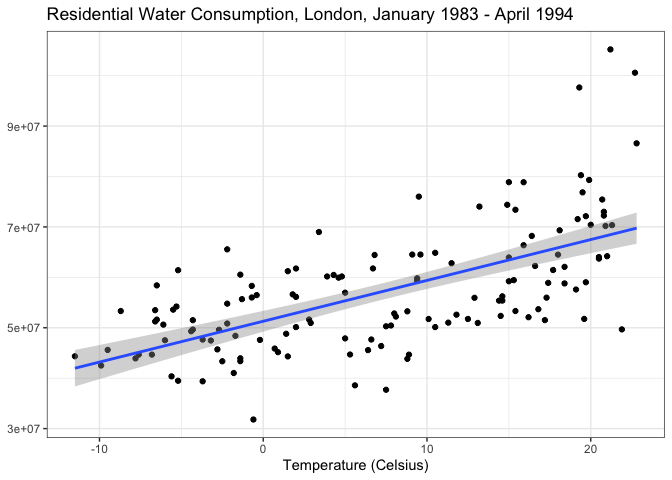
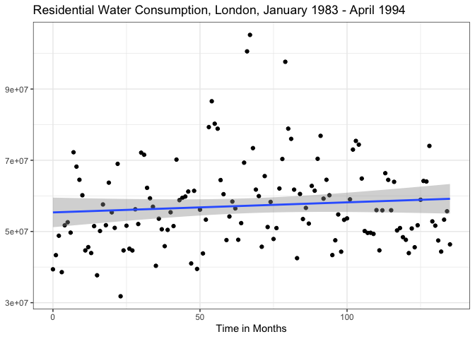

Time Series - Water Consumption
================
Bill Peterson
12/5/2019

-   [The Data - Residential Water Consumption in London, 1983 - 1994](#the-data---residential-water-consumption-in-london-1983---1994)
-   [Graphs of the relationships between X and Y; and expectations of X and Y relationship](#graphs-of-the-relationships-between-x-and-y-and-expectations-of-x-and-y-relationship)
-   [Model 1: A simple time series regression, with one X and no trend](#model-1-a-simple-time-series-regression-with-one-x-and-no-trend)
-   [Model 2: A time series regression with one X and trend](#model-2-a-time-series-regression-with-one-x-and-trend)
-   [Model 3: A time series regression with many Xs and trend; autocorrelation diagnostics](#model-3-a-time-series-regression-with-many-xs-and-trend-autocorrelation-diagnostics)
    -   [Water consumption = number of consumers + precipitation in ml + temperature in celsius + month + time in months + error](#water-consumption-number-of-consumers-precipitation-in-ml-temperature-in-celsius-month-time-in-months-error)
        -   [BP test](#bp-test)
        -   [VIF interpretation](#vif-interpretation)
        -   [ACF plot of the residuals for Model 3](#acf-plot-of-the-residuals-for-model-3)
        -   [Durbin-Watson and Breusch-Godfrey tests](#durbin-watson-and-breusch-godfrey-tests)
-   [First differenced time series regression](#first-differenced-time-series-regression)
    -   [First differenced model interpretation](#first-differenced-model-interpretation)
    -   [Durbin-Watson and Breusch-Godfrey tests - First differenced Model 3](#durbin-watson-and-breusch-godfrey-tests---first-differenced-model-3)
-   [Check for unit roots.](#check-for-unit-roots.)
-   [Auto ARIMA on the residuals of Model 2](#auto-arima-on-the-residuals-of-model-2)
-   [Auto ARIMA on the residuals of Model 3](#auto-arima-on-the-residuals-of-model-3)

## The Data - Residential Water Consumption in London, 1983 - 1994

The dataset was obtained from the R package "**tsdl**" via GitHub, and is comprised of monthly observations from January 1983 through April 1994. <https://github.com/FinYang/tsdl/tree/master/data-raw/londonwq>

The relevant tsdl data sets we want:

\[\[249\]\] "Total number of water consumers, Jan 1983 – April 1994. Missing value for June 1988 (66th obs.) estimated by intervention analysis. London, United Kingdom."

\[\[344\]\] "Monthly precipitation (in mm), Jan 1983 – April 1994. London, United Kingdom."

\[\[378\]\] "Monthly temperature (in Celsius), Jan 1983 – April 1994. London, United Kingdom."

\[\[393\]\] "Residential water consumption, Jan 1983 – April 1994. Missing value for June 1988 (66th obs.) estimated by intervention analysis. London, United Kingdom."

The faceted series plots of the variables over time clearly show seasonality in consumption, precipitation, and temperature. (Note: the water\_consump consumption variable was scaled by 1 million (consump\_1M) for the series plot.) The number of consumers shows also positive drift overtime. The seasonality and drift all seem somehwat intuitive for these variables.

<!--html_preserve-->

<!--/html_preserve-->
The dependent variable is ***water\_consump***, residential water consumption for the city of London between January 1983 through April 1994. ***water\_consump*** is the consumption for the residential consumers who had their meter read in the given month for the last two months, and is considered a proxy for the total residential water consumption. The independent variables are ***num\_consumers*** total residential consumers who had their water meters read in the given month for the last two months, ***precipitation\_ml*** monthly precipitation in millimeters, and ***temp\_celsius*** temperature in celsius. The number of residential consumers and residential water consumption were missing for June 1988 and an estimate (via intervention analysis) was provided in the dataset. ***Time in months*** has a correlation coefficient of 0.9961 with year, and was used in lieu of year as the trend.

# Graphs of the relationships between X and Y; and expectations of X and Y relationship

The XY plot of number of consumers and water consumption shows a positive trend between consumption and customers as I expected. I expect the line of best fit to have a positive coefficient.

 The XY plot of precipitation in milliliters and water consumption shows a flat to slightly negative trend. I did not think precipitation would have any effect on residential water consumption unless a significant amount of individuals with water meter accounts had a reason to adjust their consumption such as rain water collections. I expect a coefficient close to zero and possibly negative. 

The XY plot of temperature in celsius and water consumption shows a positive trend between consumption and temperature. I expect that in hotter months, individuals would need and want more water; and that temperature would have a positive coefficient.

The XY plot of month and water consumption shows what appears to be seasonality in consumption. There appears to be nonlinear and to arc or curve, with colder months (12, 1, 2, and 3) having lower values, while warmer months (6, 7, 8, 9 and 10) having some of the highest values of consumption. I expect the coefficient to be approximately positive and statistically insignificant.

The XY plot of time in months and water consumption shows a slight trend and random scattering of points. I expect the coefficient to be approximately positive and statistically insignificant.

# Model 1: A simple time series regression, with one X and no trend

    ## 
    ## Call:
    ## lm(formula = water_consump ~ num_consumers, data = tsdl_london.ts)
    ## 
    ## Residuals:
    ##       Min        1Q    Median        3Q       Max 
    ## -16002273  -7210457  -2911799   4256803  44333583 
    ## 
    ## Coefficients:
    ##                Estimate Std. Error t value Pr(>|t|)    
    ## (Intercept)   2981010.0  9255637.4   0.322    0.748    
    ## num_consumers    1729.4      293.3   5.896 2.87e-08 ***
    ## ---
    ## Signif. codes:  0 '***' 0.001 '**' 0.01 '*' 0.05 '.' 0.1 ' ' 1
    ## 
    ## Residual standard error: 11020000 on 134 degrees of freedom
    ## Multiple R-squared:  0.206,  Adjusted R-squared:  0.2001 
    ## F-statistic: 34.76 on 1 and 134 DF,  p-value: 2.871e-08

An OLS on water consumption (***water\_consump***) and the number of customers (***num\_consumers***) is statistically significant at the probability value (p-value) = 0.001. The coefficient for the number of customers is 1729.4. For every customer in the simple OLS time series regression, all else equal, monthly consumption is expected to increase approximately 1729.4 milliliters. The intercept coefficient is 2981010.0, the expected value of water consumption if there were no consumers, and statistically insignificant (p-value &gt; 0.1). The adjusted R-squared of model 1 is 0.2001

# Model 2: A time series regression with one X and trend

    ## 
    ## Call:
    ## lm(formula = water_consump ~ num_consumers + time_in_months, 
    ##     data = tsdl_london.ts)
    ## 
    ## Residuals:
    ##       Min        1Q    Median        3Q       Max 
    ## -16650312  -7333497  -3406872   4602234  44417578 
    ## 
    ## Coefficients:
    ##                  Estimate Std. Error t value Pr(>|t|)    
    ## (Intercept)    -2094949.2  9637920.1  -0.217    0.828    
    ## num_consumers      1991.8      327.8   6.076 1.22e-08 ***
    ## time_in_months   -46821.8    26895.4  -1.741    0.084 .  
    ## ---
    ## Signif. codes:  0 '***' 0.001 '**' 0.01 '*' 0.05 '.' 0.1 ' ' 1
    ## 
    ## Residual standard error: 10930000 on 133 degrees of freedom
    ## Multiple R-squared:  0.2237, Adjusted R-squared:  0.212 
    ## F-statistic: 19.16 on 2 and 133 DF,  p-value: 4.878e-08

For Model 2, I added to Model 1 a trend variable ***time\_in\_months***, which counts the months from 1983, with January 1983 as 1, and April 1994 as 136. For Model 2, the intercept coefficient is -2048127.4, the expected value of water consumption if there were no consumers, all else equal, and statistically insignificant (p-value &gt; 0.1). The coefficient for the number of customers is 1991.8, statistically significant (p-value &lt; 0.001). For every additional customer, monthly consumption is expected to increase approximately 1992 milliliters. The time in months coefficient is -46821.8 which indicates that for each additional month in the series, all else equal, water consumption is expected to decrease by -46821.8 milliliters, and statistically insignificant (p-value &gt; 0.1). The adjusted R-squared of model 2 is 0.212

    ## Analysis of Variance Table
    ## 
    ## Model 1: water_consump ~ num_consumers
    ## Model 2: water_consump ~ num_consumers + time_in_months
    ##   Res.Df        RSS Df  Sum of Sq      F  Pr(>F)  
    ## 1    134 1.6266e+16                               
    ## 2    133 1.5903e+16  1 3.6239e+14 3.0307 0.08402 .
    ## ---
    ## Signif. codes:  0 '***' 0.001 '**' 0.01 '*' 0.05 '.' 0.1 ' ' 1

A F-test of the nested model shows no statistically significant difference between models 1 and 2. The p-value for the unrestricted model “Model 2” is greater than 0.5 but less than 0.1, which indicates that probability of obtaining a F statistic of 3.0307 or larger due to random sampling is less than 1 in 10.

# Model 3: A time series regression with many Xs and trend; autocorrelation diagnostics

    ## 
    ## Call:
    ## lm(formula = water_consump ~ num_consumers + precipitation_ml + 
    ##     temp_celsius + month + time_in_months, data = tsdl_london.ts)
    ## 
    ## Residuals:
    ##       Min        1Q    Median        3Q       Max 
    ## -13553466  -6499990  -1156825   4829953  33919867 
    ## 
    ## Coefficients:
    ##                  Estimate Std. Error t value Pr(>|t|)    
    ## (Intercept)       6261848    7690950   0.814    0.417    
    ## num_consumers        1540        259   5.945 2.40e-08 ***
    ## precipitation_ml   -29610      20690  -1.431    0.155    
    ## temp_celsius       727113      82128   8.853 5.39e-15 ***
    ## month              235720     229864   1.025    0.307    
    ## time_in_months     -24651      21043  -1.171    0.244    
    ## ---
    ## Signif. codes:  0 '***' 0.001 '**' 0.01 '*' 0.05 '.' 0.1 ' ' 1
    ## 
    ## Residual standard error: 8488000 on 130 degrees of freedom
    ## Multiple R-squared:  0.5428, Adjusted R-squared:  0.5252 
    ## F-statistic: 30.86 on 5 and 130 DF,  p-value: < 2.2e-16

## Water consumption = number of consumers + precipitation in ml + temperature in celsius + month + time in months + error

For Model 3, I started with Model 2 and added: monthly preciptation ***precipitation\_ml***, monthly temperature ***temp\_celsius***, and a variable to mark the month of the year (January as 1, December as 12) ***month***. For Model 3, the intercept coefficient is 6286500 and it is the expected value of water consumption if there were no consumers, all else equal, and statistically insignificant (p-value &gt; 0.1). The coefficient for the number of customers is 1540, statistically significant (p-value &lt; 0.001). For every additional customer, all else equal, monthly consumption is expected to increase approximately 1540. The monthly precipitation coefficient is -29610, the expected change in water consumption per one unit increase in precipitation, all else equal, and statistically insignificant (p-value &gt; 0.1). The coefficient for the temperature is 727113, the expected change in water consumption per one unit increase in temperature, all else equal and statistically significant (p-value &lt; 0.001). The month coefficient is 235720, the expected change in water consumption per one unit increase in months, all else equal, and statistically insignificant (p-value &gt; 0.1). The time in months coefficient is -24651 which indicates that for each additional month in the series, all else equal, water consumption is expected to decrease by -24651, statistically insignificant (p-value &gt; 0.1). The adjusted R-squared of model 3 is 0.5252.

Residual plots consistently show the months July 1988, August 1988, and August 1989 to be high consumption values for the model. A rough eyeballing of the data values for August in 1988 and 1989 show a higher than average number of consumers and that August was the hottest of the time series in 1988 and about average in 1989. It is not clear why consumption was so high but is interesting to note and to consider interpolating for model refinement. Although the Town of Camelford, England had a water pollution incident in July 1988, it is not clear how the pollution incident is related to the City of London's water consumption given their approximate distance (230 miles/ 370 kilometers).

    ## 
    ##  Shapiro-Wilk normality test
    ## 
    ## data:  model_3$residuals
    ## W = 0.92446, p-value = 1.218e-06

The QQ plot suggests that residuals are not normally distributed. The Shapiro-Wilk normality test (p-value &lt; 0.001) reveals the residuals are not normally distributed, which indicate that this an OLS model might be inadequate.

    ## 
    ##  studentized Breusch-Pagan test
    ## 
    ## data:  model_3
    ## BP = 10.853, df = 5, p-value = 0.05437

### BP test

BP statistic of 10.853 with a p-value of 0.05437. This indicates heteroskedasticity in the errors at the p &lt; 0.1 level but not at p &lt; 0.05 level. This suggests that we should use heteroskedastic robust standard errors.

    ##    num_consumers precipitation_ml     temp_celsius            month 
    ##         1.313893         1.130409         1.157493         1.202792 
    ##   time_in_months 
    ##         1.288236

### VIF interpretation

The VIF for all variables in Model 3 are all positive and between, 1 and less than 1.5. The VIF indicates whether multicollinearity exists due to a particular independent variable. The VIF test indicates no multicollinearity among the independent variables.

### ACF plot of the residuals for Model 3

The ACF plot/correlogram shows autocorrelation (AR) at lag 1 and general autoregressive tendencies and seasonality in the lags; with the AR flipping approximately every 3 months of lag, for the two years of lag shown. AR1 indicates possible unit roots in the data generating process, unit roots indicate the data generating process mimics a random walk and would need to be corrected. A random walk is a non-stationary process with no specified mean or variance. However, the increments in a random walk process follow a white noise process, which is stable and stationary with a mean of zero.

This indicates that the OLS standard errors of the model are predictable over time, a major violation of the Gauss-Markov assumptions that errors are i.i.d. independent identically distributed. The ACF plot also shows non-stationarity of the errors, that is the mean and variance of the errors fluctuate over time (and are not stationary or constant).

### Durbin-Watson and Breusch-Godfrey tests

    ## 
    ##  Durbin-Watson test
    ## 
    ## data:  model_3
    ## DW = 1.072, p-value = 8.306e-09
    ## alternative hypothesis: true autocorrelation is greater than 0

    ## 
    ##  Breusch-Godfrey test for serial correlation of order up to 1
    ## 
    ## data:  model_3
    ## LM test = 31.243, df = 1, p-value = 2.276e-08

Unsurprisingly the Durbin-Watson and Breusch-Godfrey tests show strong statistically significance for autocorrelation. We should use autocorrelation robust standard errors, such as Newey-West standard errors, to address the serial correlation of the lags and heteroskedasticity of the Model 3.

The Newey-West standard errors for model 3:

    ## 
    ## t test of coefficients:
    ## 
    ##                    Estimate Std. Error t value  Pr(>|t|)    
    ## (Intercept)      6261848.45 5387480.86  1.1623    0.2472    
    ## num_consumers       1539.94     168.51  9.1384 1.089e-15 ***
    ## precipitation_ml  -29610.49   23790.67 -1.2446    0.2155    
    ## temp_celsius      727112.70  152710.11  4.7614 5.050e-06 ***
    ## month             235719.97  227339.01  1.0369    0.3017    
    ## time_in_months    -24651.40   26401.85 -0.9337    0.3522    
    ## ---
    ## Signif. codes:  0 '***' 0.001 '**' 0.01 '*' 0.05 '.' 0.1 ' ' 1

For comparison, the OLS standard errors for model 3 are:

    ## 
    ## Call:
    ## lm(formula = water_consump ~ num_consumers + precipitation_ml + 
    ##     temp_celsius + month + time_in_months, data = tsdl_london.ts)
    ## 
    ## Residuals:
    ##       Min        1Q    Median        3Q       Max 
    ## -13553466  -6499990  -1156825   4829953  33919867 
    ## 
    ## Coefficients:
    ##                  Estimate Std. Error t value Pr(>|t|)    
    ## (Intercept)       6261848    7690950   0.814    0.417    
    ## num_consumers        1540        259   5.945 2.40e-08 ***
    ## precipitation_ml   -29610      20690  -1.431    0.155    
    ## temp_celsius       727113      82128   8.853 5.39e-15 ***
    ## month              235720     229864   1.025    0.307    
    ## time_in_months     -24651      21043  -1.171    0.244    
    ## ---
    ## Signif. codes:  0 '***' 0.001 '**' 0.01 '*' 0.05 '.' 0.1 ' ' 1
    ## 
    ## Residual standard error: 8488000 on 130 degrees of freedom
    ## Multiple R-squared:  0.5428, Adjusted R-squared:  0.5252 
    ## F-statistic: 30.86 on 5 and 130 DF,  p-value: < 2.2e-16

# First differenced time series regression

    ## 
    ## Call:
    ## lm(formula = firstD(water_consump) ~ firstD(num_consumers) + 
    ##     firstD(precipitation_ml) + firstD(temp_celsius) + firstD(month) + 
    ##     time_in_months, data = tsdl_london.ts)
    ## 
    ## Residuals:
    ##       Min        1Q    Median        3Q       Max 
    ## -20325424  -4665378    131133   3907859  31123799 
    ## 
    ## Coefficients:
    ##                           Estimate Std. Error t value Pr(>|t|)    
    ## (Intercept)               314630.4  1373921.8   0.229  0.81923    
    ## firstD(num_consumers)       1567.0      161.6   9.697  < 2e-16 ***
    ## firstD(precipitation_ml)   21320.4    13997.4   1.523  0.13016    
    ## firstD(temp_celsius)      611571.5   126475.3   4.836 3.71e-06 ***
    ## firstD(month)            -713882.3   214066.1  -3.335  0.00111 ** 
    ## time_in_months             -5631.2    17527.6  -0.321  0.74852    
    ## ---
    ## Signif. codes:  0 '***' 0.001 '**' 0.01 '*' 0.05 '.' 0.1 ' ' 1
    ## 
    ## Residual standard error: 7929000 on 129 degrees of freedom
    ##   (1 observation deleted due to missingness)
    ## Multiple R-squared:  0.5417, Adjusted R-squared:  0.524 
    ## F-statistic:  30.5 on 5 and 129 DF,  p-value: < 2.2e-16

### First differenced model interpretation

As we previously saw, Model 3 is non-stationary. Differencing should address this. For the first differenced version of Model 3, the intercept coefficient is 314630.4, the expected value of water consumption if there were no consumers, all else equal, and statistically insignificant (p-value &gt; 0.1). The coefficient for the number of customers is 1567, statistically significant (p-value &lt; 0.001). For every additional customer, all else equal, monthly consumption is expected to increase approximately 1567 milliliters. The monthly precipitation coefficient is 21320.4, the expected change in water consumption per one unit increase in precipitation, all else equal, and statistically insignificant (p-value &gt; 0.1). The coefficient for the temperature is 611571.5, the expected change in water consumption per one unit increase in temperature, all else equal and statistically significant (p-value &lt; 0.001). The month coefficient is -713882.3, the expected change in water consumption per one unit increase in months, all else equal, and statistically significant (p-value &lt; 0.01). The time in months coefficient is -5631.2 which indicates that for each additional month in the series, all else equal, water consumption is expected to decrease by -5631.2 milliliters and statistically insignificant (p-value = 0.1). The adjusted R-squared of the first differenced model 3 is 0.524. 

The ACF plot of the first differenced model 3 still shows fluctuating positive and negative autocorrelations, including statistical significance in the 3rd, 9th, 12th, 11th and 15th lags, however it shows fewer lags with statistically significant autocorrelations than the OLS model 3. The first differenced model indicates a reduction in the autocorrelation and a better fit.

### Durbin-Watson and Breusch-Godfrey tests - First differenced Model 3

    ## 
    ##  Durbin-Watson test
    ## 
    ## data:  lm.Dmodel_3
    ## DW = 2.1156, p-value = 0.7361
    ## alternative hypothesis: true autocorrelation is greater than 0

    ## 
    ##  Breusch-Godfrey test for serial correlation of order up to 1
    ## 
    ## data:  lm.Dmodel_3
    ## LM test = 0.46349, df = 1, p-value = 0.496

The Durbin-Watson and Breusch-Godfrey tests of the first differences also showed improvement in autocorrelation and removed the statistical significance of autocorrelation in the errors.

    ## 
    ##  Breusch-Godfrey test for serial correlation of order up to 1
    ## 
    ## data:  lm.Dmodel_3
    ## LM test = 0.46349, df = 1, p-value = 0.496

    ## 
    ##  Breusch-Godfrey test for serial correlation of order up to 2
    ## 
    ## data:  lm.Dmodel_3
    ## LM test = 0.59349, df = 2, p-value = 0.7432

    ## 
    ##  Breusch-Godfrey test for serial correlation of order up to 3
    ## 
    ## data:  lm.Dmodel_3
    ## LM test = 19.922, df = 3, p-value = 0.0001762

    ## 
    ##  Breusch-Godfrey test for serial correlation of order up to 4
    ## 
    ## data:  lm.Dmodel_3
    ## LM test = 28.664, df = 4, p-value = 9.147e-06

    ## 
    ##  Breusch-Godfrey test for serial correlation of order up to 5
    ## 
    ## data:  lm.Dmodel_3
    ## LM test = 31.543, df = 5, p-value = 7.318e-06

    ## 
    ##  Breusch-Godfrey test for serial correlation of order up to 6
    ## 
    ## data:  lm.Dmodel_3
    ## LM test = 31.595, df = 6, p-value = 1.951e-05

    ## 
    ##  Breusch-Godfrey test for serial correlation of order up to 7
    ## 
    ## data:  lm.Dmodel_3
    ## LM test = 45.36, df = 7, p-value = 1.164e-07

    ## 
    ##  Breusch-Godfrey test for serial correlation of order up to 8
    ## 
    ## data:  lm.Dmodel_3
    ## LM test = 47.472, df = 8, p-value = 1.246e-07

    ## 
    ##  Breusch-Godfrey test for serial correlation of order up to 9
    ## 
    ## data:  lm.Dmodel_3
    ## LM test = 55.98, df = 9, p-value = 7.918e-09

    ## 
    ##  Breusch-Godfrey test for serial correlation of order up to 10
    ## 
    ## data:  lm.Dmodel_3
    ## LM test = 61.305, df = 10, p-value = 2.051e-09

    ## 
    ##  Breusch-Godfrey test for serial correlation of order up to 11
    ## 
    ## data:  lm.Dmodel_3
    ## LM test = 63.4, df = 11, p-value = 2.152e-09

    ## 
    ##  Breusch-Godfrey test for serial correlation of order up to 12
    ## 
    ## data:  lm.Dmodel_3
    ## LM test = 63.478, df = 12, p-value = 5.204e-09

Breusch-Godfrey tests do however show that autocorrelation remains are higher orders, specifically for all lags that between 3 and 12 lags of the model.

# Check for unit roots.

Augmented Dicky Fuller (DF) tests were conducted to test for unit roots in the underlying variables. The DF test of the dependent variable (water consumption) indicates that we cannot reject the null of unit roots at 6 lags of the variable (i.e. there are unit roots that need to be addressed).

    ## 
    ## Title:
    ##  Augmented Dickey-Fuller Test
    ## 
    ## Test Results:
    ##   PARAMETER:
    ##     Lag Order: 1
    ##   STATISTIC:
    ##     Dickey-Fuller: -0.8472
    ##   P VALUE:
    ##     0.3439 
    ## 
    ## Description:
    ##  Thu Jan 21 22:38:44 2021 by user:

    ## 
    ## Title:
    ##  Augmented Dickey-Fuller Test
    ## 
    ## Test Results:
    ##   PARAMETER:
    ##     Lag Order: 2
    ##   STATISTIC:
    ##     Dickey-Fuller: -0.8802
    ##   P VALUE:
    ##     0.3333 
    ## 
    ## Description:
    ##  Thu Jan 21 22:38:44 2021 by user:

    ## 
    ## Title:
    ##  Augmented Dickey-Fuller Test
    ## 
    ## Test Results:
    ##   PARAMETER:
    ##     Lag Order: 3
    ##   STATISTIC:
    ##     Dickey-Fuller: -0.8286
    ##   P VALUE:
    ##     0.3498 
    ## 
    ## Description:
    ##  Thu Jan 21 22:38:44 2021 by user:

    ## 
    ## Title:
    ##  Augmented Dickey-Fuller Test
    ## 
    ## Test Results:
    ##   PARAMETER:
    ##     Lag Order: 4
    ##   STATISTIC:
    ##     Dickey-Fuller: -0.6352
    ##   P VALUE:
    ##     0.4114 
    ## 
    ## Description:
    ##  Thu Jan 21 22:38:44 2021 by user:

    ## 
    ## Title:
    ##  Augmented Dickey-Fuller Test
    ## 
    ## Test Results:
    ##   PARAMETER:
    ##     Lag Order: 5
    ##   STATISTIC:
    ##     Dickey-Fuller: -0.5224
    ##   P VALUE:
    ##     0.4474 
    ## 
    ## Description:
    ##  Thu Jan 21 22:38:44 2021 by user:

    ## 
    ## Title:
    ##  Augmented Dickey-Fuller Test
    ## 
    ## Test Results:
    ##   PARAMETER:
    ##     Lag Order: 6
    ##   STATISTIC:
    ##     Dickey-Fuller: -0.5637
    ##   P VALUE:
    ##     0.4342 
    ## 
    ## Description:
    ##  Thu Jan 21 22:38:44 2021 by user:

Interestingly, the Ljung-Box "white-noise" tests, for the residuals in models 1, 2, and 3 do not indicate unit roots.

    ## 
    ##  Box-Ljung test
    ## 
    ## data:  resid(model_3)
    ## X-squared = 285.29, df = 40, p-value < 2.2e-16

    ## 
    ##  Box-Ljung test
    ## 
    ## data:  resid(model_2)
    ## X-squared = 679.45, df = 40, p-value < 2.2e-16

    ## 
    ##  Box-Ljung test
    ## 
    ## data:  resid(model_1)
    ## X-squared = 682.5, df = 40, p-value < 2.2e-16

# Auto ARIMA on the residuals of Model 2

    ## Series: model_2$residuals 
    ## ARIMA(3,0,1) with zero mean 
    ## 
    ## Coefficients:
    ##          ar1     ar2      ar3    ma1
    ##       0.2434  0.4504  -0.4579  0.613
    ## s.e.  0.2233  0.1512   0.0760  0.271
    ## 
    ## sigma^2 estimated as 5.165e+13:  log likelihood=-2338.74
    ## AIC=4687.47   AICc=4687.93   BIC=4702.04

The auto.ARIMA function indcates that an ARIMA of 3,0,1 is the best structure for the errors in Model 2. This indicates the errors in Model 2 should have an autocorrelation (AR) correction of 3 (i.e that a lag of 3 in the errors for the dependent variable (water consumption)), no differencing, and a moving average correction of 1 (i.e. 1 lag of the errors from the first lag (moving average of 1)). The AIC (4687.47) is the measure of model fit and the higher the AIC the better the model.

The arima() function generated an error **"Error in solve.default(res$hessian \* n.used, A) : system is computationally singular: reciprocal condition number = 1.66623e-16"** when I went to see the coefficients (weights for each lag) auto.ARIMA() suggested for Model 2. I reduced the scale of the y-variable ***water\_consump*** data by 10, which provided accurate weights for the y-variable lags (ar1, ar2, and ar3) and for the moving average (ma1).

    ## 
    ## Call:
    ## arima(x = y_scaled_by_10, order = c(3, 0, 1), xreg = xvars_m2)
    ## 
    ## Coefficients:
    ##          ar1     ar2      ar3     ma1  intercept  num_consumers  time_in_months
    ##       0.2298  0.4696  -0.4565  0.6382   235558.3       183.8041       -4093.530
    ## s.e.  0.2370  0.1573   0.0769  0.2915   454542.1        12.9877        3359.364
    ## 
    ## sigma^2 estimated as 4.961e+11:  log likelihood = -2024.89,  aic = 4065.78
    ## 
    ## Training set error measures:
    ##                    ME     RMSE      MAE       MPE     MAPE      MASE
    ## Training set 204.7861 704332.8 498967.3 -1.319632 8.803194 0.5615818
    ##                     ACF1
    ## Training set -0.03028363

The coefficients for ***ar1*** (0.2298, s.e. = 0.237), ***ar2*** (0.4696, s.e. = 0.1573), and ***ar3*** (-0.4565, s.e. = 0.0769) are the weights for the first, second and third lags of the dependent variable, ***water\_consump***. The coefficient for ***ma1*** (0.6382, s.e. = 0.2914) is the weighted sum of the current and lagged errors, for a lag of 1. After reducing the scale o the y-variable ***water\_consump*** data by 10, the coefficients for the intercept, number of consumers and time in months variables were also reduced by a scale of 10. After returning to the normal scale, the coefficient for the ***intercept*** is 2396518 (s.e. = 4554258), and it represents the water consumption, when all other independent variables are zero. After returning to the normal scale, the coefficient for ***num\_consumers*** is 1838.041 (s.e. = 129.852), and it represents the change in water consumption, all else equal, for one unit increase in number of consumers. After returning to the normal scale, the coefficient for ***time\_in\_months*** is -40935.30 (s.e. = 33578.81), and it represents the change in water consumption, all else equal, for one unit increase in the monthly time trend.

# Auto ARIMA on the residuals of Model 3

    ## Series: model_3$residuals 
    ## ARIMA(2,0,2) with zero mean 
    ## 
    ## Coefficients:
    ##          ar1     ar2     ma1     ma2
    ##       0.3490  -0.522  0.1694  0.7238
    ## s.e.  0.1327   0.118  0.1076  0.1007
    ## 
    ## sigma^2 estimated as 4.673e+13:  log likelihood=-2331.8
    ## AIC=4673.6   AICc=4674.07   BIC=4688.17

The auto.ARIMA function indcates that an ARIMA of 2,0,2 is the best structure for the errors in Model 3. This indicates that the errors in Model 3 should have an AR correction of 2 (i.e. that a lag of 2 for the dependent variable (water consumption)), no differencing, and a moving average correction of 2 (i.e. 2 lags of the errors from the previous lags (moving average of 2)). The AIC for model 3 (4673.6) is slightly less that the AIC for model 2, indicating model 2 is the better model.

    ## 
    ## Call:
    ## arima(x = y_scaled_by_10, order = c(2, 0, 2), xreg = xvars_m3)
    ## 
    ## Coefficients:
    ##          ar1      ar2     ma1     ma2  intercept  num_consumers  time_in_months
    ##       0.4646  -0.4072  0.1954  0.6385   316368.2       166.1961       -2921.290
    ## s.e.  0.1424   0.1353  0.1138  0.1179   491785.3        14.4189        2752.791
    ##       precipitation_ml  temp_celsius      month
    ##               1159.913      63777.25  -28642.17
    ## s.e.          1203.884      11117.77   21050.03
    ## 
    ## sigma^2 estimated as 4.103e+11:  log likelihood = -2011.87,  aic = 4045.74
    ## 
    ## Training set error measures:
    ##                   ME   RMSE      MAE       MPE     MAPE      MASE       ACF1
    ## Training set 260.318 640542 484995.9 -1.175073 8.695643 0.5458571 0.01040057

The coefficients for ***ar1*** (0.4646, s.e. = 0.1424) and ***ar2*** (-0.4072, s.e. = 0.1353) are the weights for the first and second lags of the dependent variable, water consumption. The coefficient for ***ma1*** (0.1954, s.e. = 0.1138) and ***ma2*** (0.6385, s.e. = 0.1179) are the weighted sum of the current and lagged errors, for the first and second lags. After reducing the scale of the y-variable ***water\_consump*** data by 10, the coefficients for the intercept, number of consumers and time in months variables were also reduced by a scale of 10. After returning to the normal scale, the coefficient for the ***intercept*** is 3192895 (s.e. = 4921449), and it represents the water\_consumption, when all other independent variables are zero. After returning to the normal scale, the coefficient for ***num\_consumers*** is 1661.961 (s.e. = 144.190), and it represents the change in water\_consumption, all else equal, for one unit increase in number of consumers. After returning to the normal scale, the coefficient for ***time\_in\_months*** is -29212.90 (s.e. = 27527.78), and it represents the change in water\_consumption, all else equal, for one unit increase in the monthly time trend. After returning to the normal scale, the coefficient for ***precipitation\_ml*** is 11599.13 (s.e. = 12038.03), and it represents the change in water\_consumption, all else equal, for one unit increase in the precipitation by 1 unit change in precipitation\_ml (1 milliliter). After returning to the normal scale, the coefficient for ***temp\_celsius*** is 637772.5 (s.e. = 111173), and it represents the change in water\_consumption, all else equal, for one unit increase in number of consumers. After returning to the normal scale, the coefficient for ***month*** is -286421.7 (s.e. = 210510.6), and it represents the change in water\_consumption, all else equal, for one unit increase in the 12 levels for the months of the year (January = 1 ... December = 12).

    ## Series: lm.Dmodel_3$residuals 
    ## ARIMA(0,0,0) with zero mean 
    ## 
    ## sigma^2 estimated as 6.008e+13:  log likelihood=-2333.1
    ## AIC=4668.21   AICc=4668.24   BIC=4671.11

The auto.ARIMA function for the first differenced version of model 3 indicates an ARIMA (0,0,0) is the best structure for the errors in the model. This indicates no further correction to the errors for the model. The AIC is the lowest for this model (compared to for Model 2 and Model 3), however at 4668.21. For interpretation of ARIMA(0,0,0) for the First Difference Model, see the section entitled ***"First differenced model interpretation"***.
